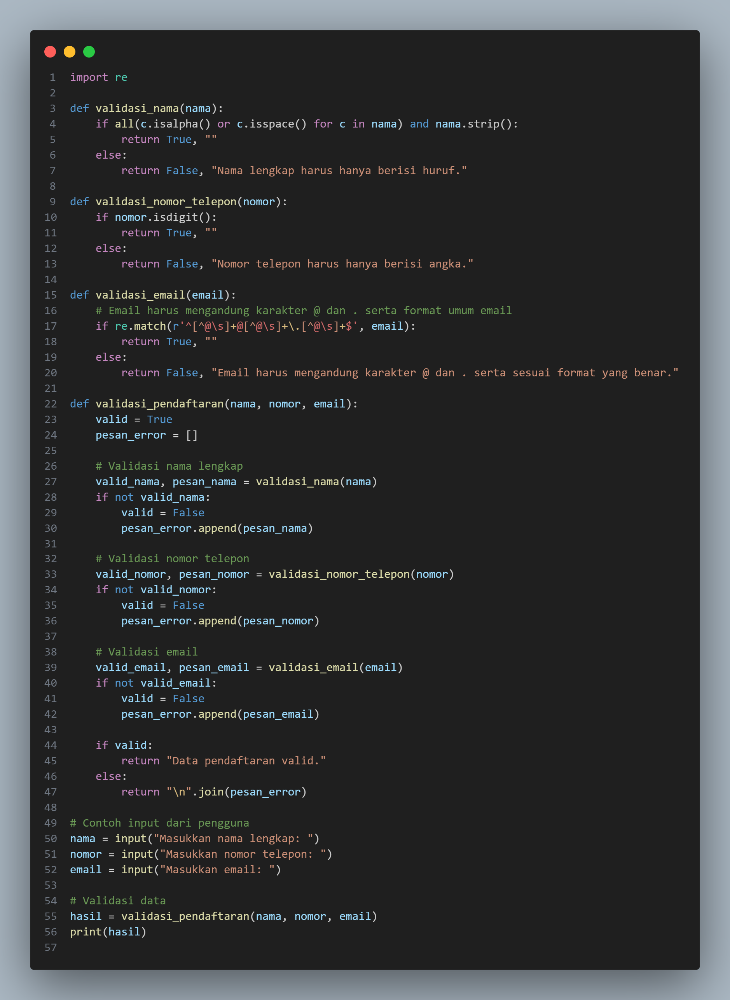

# STUDI KASUS
# Validasi Form Input

Nama: Diva Zahrotunnisa

NIM: 312410415

Kelas: TI.24.A3

# Validasi Input Pendaftaran Online

Program ini dibuat untuk memvalidasi data input pada proses pendaftaran online. Validasi dilakukan pada tiga jenis data: nama lengkap, nomor telepon, dan email. Program ini memberikan pesan kesalahan yang spesifik jika ada input yang tidak valid dan menyatakan bahwa data pendaftaran valid jika semua input benar.

## Cara Kerja Program
1. **Validasi Nama Lengkap**
   - Hanya boleh berisi huruf (A-Z atau a-z).
   - Jika mengandung karakter lain, akan ditampilkan pesan kesalahan.

2. **Validasi Nomor Telepon**
   - Hanya boleh berisi angka (0-9).
   - Jika mengandung huruf atau simbol lain, akan ditampilkan pesan kesalahan.

3. **Validasi Email**
   - Harus mengandung karakter `@` dan `.` dalam format yang benar.
   - Format yang diharapkan, misalnya: `user@example.com`.
   - Jika format tidak sesuai, akan ditampilkan pesan kesalahan.

## Persyaratan
- Python 3.x
- Library `re` (sudah termasuk dalam Python standar)

## Cara Menjalankan Program
1. Clone repositori ini atau salin file program ke komputer Anda.
2. Buka terminal atau command prompt.
3. Jalankan program menggunakan perintah:
   ```bash
   python nama_file.py
   ```
4. Masukkan data sesuai dengan permintaan program:
   - Nama lengkap
   - Nomor telepon
   - Email
5. Program akan menampilkan hasil validasi:
   - Pesan "Data pendaftaran valid" jika semua input benar.
   - Pesan kesalahan untuk setiap data yang tidak valid.

## input & output

## input 



### output Valid
```
Masukkan nama lengkap: Diva Zahrotunnisa
Masukkan nomor telepon: 085312125555
Masukkan email: dipa123@gmail.com
Data pendaftaran valid.
```


### Input Tidak Valid
```
Masukkan nama lengkap: Diva Zahrotunnisa.
Masukkan nomor telepon: 085312125555.
Masukkan email: dipa123gmail
Nama lengkap harus hanya berisi huruf.
Nomor telepon harus hanya berisi angka.
Email harus mengandung karakter @ dan . serta sesuai format yang benar.
```


## Fitur dan Kemampuan:
- Kesesuaian dengan berbagai pengguna
- Dapat Dimodifikasi
- Keamanan dasar input
- Laporan kesalahan yang spesifik